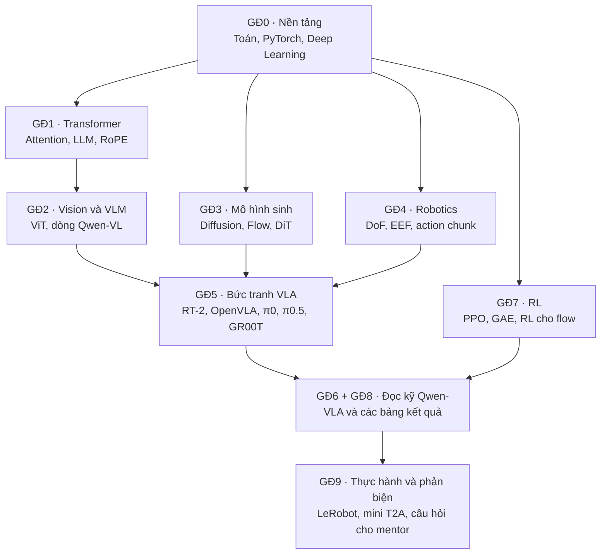

# Roadmap học VLA & Qwen-VLA cho người mới

*Cập nhật: 02/10/2026*

## Cách dùng roadmap

Mục tiêu: sau khoảng 8–10 tuần (10–12 giờ/tuần), bạn giải thích được mọi phần của paper Qwen-VLA, đặt nó đúng chỗ trong bức tranh VLA, và tự chạy được một policy robot nhỏ.

Roadmap đi theo kiểu xoắn ốc: bạn đã đọc lướt paper, giờ học nền tảng, rồi quay lại đọc kỹ. Không cần thành thạo hết các giai đoạn đầu mới được đọc paper; mỗi giai đoạn đều ghi rõ nó "mở khóa" phần nào của paper.

Mỗi mục được gắn mức ưu tiên:

- **[Bắt buộc]**: thiếu thì không hiểu được paper.
- **[Nên]**: giúp hiểu sâu và trả lời được câu hỏi của mentor.
- **[Mở rộng]**: kiến thức ngoài paper, học khi có thời gian.

| Giai đoạn | Trọng tâm | Thời lượng gợi ý | Mở khóa phần nào của paper |
| --- | --- | --- | --- |
| 0. Nền tảng | Toán, PyTorch, Deep Learning cơ bản | 1 tuần (bỏ qua nếu đã vững) | Các công thức (1)–(5), Section 4 |
| 1. Transformer & LLM | Attention, RoPE, next-token prediction | 1 tuần | 2.2, 2.3, 2.5 |
| 2. Vision & VLM | ViT, CLIP, dòng Qwen-VL | 1 tuần | 2.2, 3.2.1, 3.2.5 |
| 3. Mô hình sinh | Diffusion, Flow Matching, DiT | 1,5 tuần | 2.2, 2.5, 5.2.1 |
| 4. Robotics cơ bản | DoF, EEF, joint, action chunk, imitation learning | 1 tuần | 2.3, 2.4, 3.2 |
| 5. Bức tranh VLA | RT-2, OpenVLA, π0, π0.5, GR00T | 1 tuần | 1, 5.1 (các baseline) |
| 6. Đọc kỹ Qwen-VLA | Từng section, từng bảng | 1 tuần | Toàn bộ |
| 7. Reinforcement Learning | PPO, GAE, RL cho flow matching | 1 tuần | 3.1 Stage IV, 4.2, 5.2.3 |
| 8. Benchmark | Đọc hiểu các bảng kết quả | 0,5 tuần | 5.1, 5.2 |
| 9. Thực hành & phản biện | Code, đánh giá điểm mạnh/yếu | Liên tục | Toàn bộ |

Giai đoạn 1, 3, 4, 7 độc lập với nhau, có thể học song song. Giai đoạn 2 cần giai đoạn 1; giai đoạn 5 và 6 cần các giai đoạn trước.



Đọc sơ đồ từ trên xuống: mũi tên chỉ "cần học trước". Giai đoạn 7 (RL) chỉ cần cho phần cuối của paper nên có thể để sau.

**Lưu ý:** khi trích số liệu, dùng bản PDF. Bản .md của paper có nhiều bảng bị lệch cột hoặc đảo số (Bảng 4, 5, 7, 11).

---

## Giai đoạn 0 — Nền tảng

Đây là "ngôn ngữ chung" để đọc mọi công thức trong paper. Nếu bạn đã vững Deep Learning cơ bản, chỉ cần ôn nhanh phần ODE và xác suất.

### Toán

- **[Bắt buộc] Đại số tuyến tính:** vector, ma trận, phép nhân ma trận, shape của tensor. Ví dụ, trong paper `Y ∈ R^(H×K)` là một ma trận H bước × K kênh.
- **[Bắt buộc] Xác suất:** phân phối Gaussian N(0, I), kỳ vọng E[·], log-likelihood, phân phối có điều kiện p(y | x).
- **[Bắt buộc] Giải tích:** gradient, chain rule, ý nghĩa của MSE.
- **[Nên] Phương trình vi phân (ODE) và phương pháp Euler:** flow matching sinh hành động bằng cách "đi từng bước nhỏ" theo một trường vận tốc, chính là Euler integration.
- **[Mở rộng] Thống kê mô tả:** percentile/quantile, dùng trong công thức chuẩn hóa (5).

### Lập trình

- **[Bắt buộc] Python + NumPy.**
- **[Bắt buộc] PyTorch:** tensor, autograd, `nn.Module`, vòng lặp training, `DataLoader`, mask và broadcasting.

### Deep Learning cơ bản

- **[Bắt buộc]** Supervised learning, hàm loss (MSE, cross-entropy), optimizer (AdamW), learning rate schedule (cosine decay), gradient clipping.
- **[Bắt buộc]** Pretrain → fine-tune, đóng băng (freeze) một phần mô hình, catastrophic forgetting (quên kiến thức cũ khi học cái mới).
- **[Nên]** Overfitting, train/val/test split, ablation study là gì.

### Tài liệu gợi ý

- 3Blue1Brown, series *Essence of Linear Algebra* và *Neural Networks* (YouTube).
- Andrej Karpathy, *Neural Networks: Zero to Hero* (YouTube), học PyTorch qua code thật.
- Sách *Dive into Deep Learning* (d2l.ai), có bản dịch tiếng Việt *Đắm mình vào Học Sâu*.
- PyTorch official tutorials: *Learn the Basics*.

### Tự kiểm tra

- [ ] Giải thích được vì sao paper phải dùng mask M khi tính loss trong công thức (1).
- [ ] Viết được một vòng training PyTorch cho bài toán hồi quy đơn giản.
- [ ] Giải thích "freeze VLM, chỉ train DiT" nghĩa là gì ở mức code (`requires_grad = False`).

---

## Giai đoạn 1 — Transformer & LLM

Cả "đại não" (Qwen3.5) lẫn "tiểu não" (DiT) của Qwen-VLA đều là Transformer, nên đây là kiến thức quan trọng nhất.

### Khái niệm cần nắm

1. **[Bắt buộc] Tokenization và embedding:** chữ được cắt thành token, mỗi token thành một vector.
2. **[Bắt buộc] Self-attention (Q, K, V) và multi-head attention:** mỗi token "nhìn" các token khác để cập nhật biểu diễn của mình.
3. **[Bắt buộc] Kiến trúc decoder-only và next-token prediction:** đây chính là loss L_vl ở công thức (3).
4. **[Bắt buộc] Hidden states:** các vector đầu ra của từng lớp. Paper lấy hidden states của VLM đưa sang DiT, đây là "cầu nối" giữa hai khối.
5. **[Nên] Positional encoding → RoPE:** cách mô hình biết thứ tự token. Paper dùng *multi-section RoPE* (M-RoPE), tức RoPE mở rộng cho cả chiều thời gian, chiều cao, chiều rộng của ảnh/video.
6. **[Nên] Các biến thể attention để chạy nhanh:** Grouped-Query Attention (GQA) và linear attention có cổng (gated linear attention). Qwen3.5 trộn hai loại này: phần lớn các lớp dùng linear attention (rẻ với chuỗi dài), xen kẽ đều đặn vài lớp softmax attention đầy đủ.
7. **[Nên] Quy trình huấn luyện LLM:** pretraining → SFT → RL. Qwen-VLA bắt chước đúng quy trình này cho robot (T2A/CPT → SFT → RL).
8. **[Nên] Prompt conditioning:** vì sao chỉ cần thêm một câu mô tả robot vào prompt là mô hình đổi được hành vi. Đây là nền tảng để hiểu *embodiment-aware prompt* (Section 2.3).

### Mức độ học công thức toán

Không cần chứng minh, nhưng cũng không chỉ lướt. Với mỗi công thức, trả lời được ba câu là đủ: (1) mỗi ký hiệu là gì và shape ra sao, (2) công thức làm gì nói bằng một câu đời thường, (3) viết ra PyTorch thì khoảng mấy dòng.

- **Cần hiểu chắc:** công thức attention softmax(QKᵀ/√d)·V (tự code lại một lần), next-token loss (cross-entropy), luồng shape [batch, số token, chiều ẩn].
- **Chỉ cần nắm ý:** chi tiết toán của RoPE/M-RoPE, linear attention, GQA, multi-head.

### Tài liệu gợi ý

- Jay Alammar, *The Illustrated Transformer* (blog, có hình minh họa rất dễ hiểu).
- Andrej Karpathy, *Let's build GPT: from scratch, in code, spelled out* (YouTube).
- Paper gốc *Attention Is All You Need* (Vaswani et al., 2017), đọc sau khi đã xem hai nguồn trên.
- [Mở rộng] *RoFormer* (RoPE, Su et al., 2021); *GQA* (Ainslie et al., 2023).

### Tự kiểm tra

- [ ] Vẽ lại được luồng dữ liệu: token → embedding → N lớp Transformer → hidden states → dự đoán token tiếp theo.
- [ ] Giải thích được "concatenate VLM hidden states với noisy action chunk rồi joint self-attention" (Section 2.2) nghĩa là gì.
- [ ] Trả lời: vì sao lại cần linear attention khi xử lý nhiều ảnh, nhiều camera?

---

## Giai đoạn 2 — Computer Vision & Vision-Language Model

Giai đoạn này trả lời câu hỏi: làm sao một mô hình ngôn ngữ "nhìn" được ảnh? Đây cũng là chỗ bạn hiểu Qwen là gì.

### Khái niệm cần nắm

1. **[Bắt buộc] Vision Transformer (ViT):** cắt ảnh thành các ô (patch), mỗi ô thành một token, rồi đưa qua Transformer như với chữ.
2. **[Nên] CLIP:** học ghép ảnh với mô tả bằng contrastive learning; nhiều VLM dùng vision encoder kiểu CLIP/SigLIP.
3. **[Bắt buộc] Cấu trúc VLM phổ biến:** vision encoder → projector → LLM (mẫu LLaVA). Token ảnh được "chèn" vào chuỗi token chữ.
4. **[Bắt buộc] Early fusion và spatial merging:** Qwen3.5 trộn token ảnh vào chuỗi chữ từ sớm, và gộp các patch kề nhau để giảm số token.
5. **[Nên] Các khả năng VLM liên quan trực tiếp đến robot:** visual grounding (chỉ ra vật trong ảnh bằng bounding box), referring expression ("cái cốc bên trái"), VQA, OCR, suy luận không gian. Đây là lý do paper trộn dữ liệu Spatial Grounding, Driving VQA vào pretraining.
6. **[Nên] Ảnh nhiều camera:** paper bọc mỗi ảnh bằng tag `<|ego|>`, `<|cam_left_wrist|>`... để mô hình biết ảnh đến từ camera nào.

### Dòng mô hình Qwen (để hiểu "Qwen" là gì)

Qwen (通义千问) là họ mô hình mở của Alibaba. Các bản VLM nối tiếp nhau như sau:

| Phiên bản | Năm | Điểm mới chính |
| --- | --- | --- |
| Qwen-VL | 2023 | VLM đầu tiên của họ Qwen: ViT + LLM, hỗ trợ grounding bằng bounding box |
| Qwen2-VL | 2024 | Độ phân giải ảnh động (ảnh to → nhiều token hơn), M-RoPE cho ảnh/video |
| Qwen2.5-VL | 2025 | Grounding và hiểu video dài tốt hơn, làm agent điều khiển máy tính |
| Qwen3-VL | 2025 | Ngữ cảnh dài hơn, suy luận không gian và video mạnh hơn |
| Qwen3.5 | 2026 | Native multimodal (ảnh, video, chữ trong một mô hình từ đầu), hybrid attention; bản 4B là backbone của Qwen-VLA |

Điểm cần nhớ: Qwen-VLA **không** huấn luyện từ đầu mà "mượn" toàn bộ khả năng nhìn và hiểu của Qwen3.5-4B, rồi dạy thêm cách hành động.

### Tài liệu gợi ý

- Paper ViT: *An Image is Worth 16x16 Words* (Dosovitskiy et al., 2020).
- Paper CLIP (Radford et al., 2021), đọc phần ý tưởng.
- Paper LLaVA: *Visual Instruction Tuning* (Liu et al., 2023), kiến trúc VLM dễ hiểu nhất.
- *Qwen2-VL technical report* (arXiv 2409.12191) và *Qwen3-VL technical report* (arXiv 2511.21631), cả hai đều được paper trích dẫn.
- Blog Qwen3.5 tại qwen.ai (paper trích dẫn).

### Tự kiểm tra

- [ ] Giải thích một ảnh 224×224 với patch 16×16 thành bao nhiêu token.
- [ ] Giải thích vì sao trộn dữ liệu VQA/grounding vào lại giúp robot tốt hơn (gợi ý: Hình 7a, RoboCasa +4.9 điểm).
- [ ] Phân biệt được Qwen3.5 (VLM) và Qwen-VLA (VLA).

---

## Giai đoạn 3 — Mô hình sinh: Diffusion, Flow Matching, DiT

Đây là "bộ phận vận động" của Qwen-VLA. Hiểu được giai đoạn này là hiểu được action expert, công thức (1)–(2), ablation về timestep và phần RL.

### Câu hỏi khởi đầu: vì sao không dùng hồi quy MSE đơn giản?

Giả sử có hai cách đúng để cầm cái cốc: từ trái hoặc từ phải. Nếu dạy mô hình bằng MSE, nó sẽ học **trung bình** hai cách và đưa tay thẳng vào giữa, tức là sai cả hai. Phân phối hành động có nhiều "đỉnh" (multimodal), nên cần một mô hình **sinh** (generative) biết lấy mẫu một trong các cách đúng. Diffusion và flow matching giải quyết đúng vấn đề này.

### Khái niệm cần nắm

1. **[Bắt buộc] Diffusion (DDPM):** thêm nhiễu dần vào dữ liệu, rồi dạy mạng khử nhiễu ngược lại. Lúc dùng: xuất phát từ nhiễu thuần, khử nhiễu từng bước → ra dữ liệu.
2. **[Bắt buộc] Flow Matching / Rectified Flow:** phiên bản gọn hơn. Nối dữ liệu sạch Y0 với nhiễu Y1 bằng một đường thẳng, rồi dạy mạng dự đoán **vận tốc** dọc đường đó.
3. **[Bắt buộc] Quy ước của paper:** τ = 0 là hành động sạch, τ = 1 là nhiễu thuần. Lúc chạy, đi từ τ = 1 về τ = 0 qua vài bước Euler.
4. **[Bắt buộc] Phân phối lấy mẫu timestep p(τ):** quyết định mức nhiễu nào được học nhiều. Paper so sánh Beta và Sigmoid-Normal (logit-normal, từ Stable Diffusion 3). Kết quả: dùng Sigmoid-Normal ở T2A, Beta ở CPT/SFT.
5. **[Bắt buộc] DiT (Diffusion Transformer):** dùng Transformer thay cho U-Net làm mạng khử nhiễu. **AdaLN** là cách đưa timestep τ vào mạng: τ điều chỉnh scale/shift của LayerNorm.
6. **[Nên] ODE và SDE:** flow matching khi chạy là một ODE tất định. Thêm nhiễu ở mỗi bước biến nó thành SDE, khi đó mỗi bước là một phân phối Gaussian tính được log-probability. Đây là mẹo cho phần RL (Section 4.2).
7. **[Mở rộng] Classifier-free guidance, consistency models:** các kỹ thuật tăng chất lượng hoặc giảm số bước, không dùng trong paper nhưng hay gặp.

Công thức cốt lõi cần thuộc (từ Section 2.5):

```latex
Y_\tau = (1-\tau)\,Y_0 + \tau\,Y_1, \quad Y_1 \sim \mathcal{N}(0, I)
\mathcal{L} = \big\| v_\theta(Y_\tau, \tau \mid \text{ảnh, câu lệnh, robot}) - (Y_1 - Y_0) \big\|^2
```

### Tài liệu gợi ý

- Lilian Weng, blog *What are Diffusion Models?* (đọc phần trực giác, chưa cần mọi chứng minh).
- Paper *Flow Matching for Generative Modeling* (Lipman et al., 2023) và tài liệu *Flow Matching Guide and Code* (Lipman et al., 2024), có code mẫu.
- Paper DiT: *Scalable Diffusion Models with Transformers* (Peebles & Xie, 2023), chú ý phần AdaLN.
- Paper *Diffusion Policy* (Chi et al., 2023): lần đầu áp diffusion vào điều khiển robot, giải thích rất rõ vấn đề multimodal.
- [Mở rộng] *Score-Based Generative Modeling through SDEs* (Song et al., 2021) cho phần ODE/SDE.

### Bài tập thực hành

- [ ] Tự viết flow matching (khoảng 100 dòng PyTorch) để sinh dữ liệu 2D hình "hai mặt trăng" (`sklearn.datasets.make_moons`). Đây là bài tập đáng giá nhất của cả roadmap.

### Tự kiểm tra

- [ ] Giải thích bằng ví dụ "cầm cốc từ trái hoặc phải" vì sao cần mô hình sinh.
- [ ] Giải thích vì sao paper nói "chỉ vài bước Euler" giúp điều khiển thời gian thực.
- [ ] Đọc Hình 6b và giải thích kết quả 71.1% so với 59.4%.

---

## Giai đoạn 4 — Robotics cơ bản

Người học AI thường bỏ qua phần này, nhưng thiếu nó thì Bảng 2, Section 2.3–2.4 và toàn bộ phần dữ liệu sẽ chỉ là một danh sách tên lạ.

### Robot và cách mô tả hành động

1. **[Bắt buộc] Embodiment:** "thân thể" của agent, tức loại robot cụ thể (một tay, hai tay, có bánh xe, bàn tay người...).
2. **[Bắt buộc] DoF (bậc tự do):** số khớp độc lập. Ví dụ cánh tay 7-DoF, robot hình người whole-body 29-DoF.
3. **[Bắt buộc] Joint space và Cartesian space:** điều khiển bằng góc từng khớp (Joint) hoặc bằng vị trí + hướng của đầu tay robot (End-Effector, EEF).
4. **[Bắt buộc] Absolute và Delta:** ra lệnh "đến vị trí X" (Abs) hoặc "dịch thêm Δx" (Δ). Đọc lại Bảng 2 sau khi học xong mục này.
5. **[Nên] Biểu diễn hướng xoay:** Euler angles, quaternion, axis-angle, ma trận xoay; SE(3) là "vị trí + hướng" trong không gian 3D.
6. **[Nên] Forward/Inverse Kinematics:** chuyển giữa góc khớp và vị trí EEF.
7. **[Nên] Gripper và dexterous hand:** kẹp hai ngón (một số: độ mở) và bàn tay nhiều ngón. Với tay người, paper dùng mô hình MANO và nén 45 chiều về 10 *eigengrasps* bằng PCA.
8. **[Bắt buộc] Proprioception (state):** robot "tự cảm nhận" góc khớp hiện tại. Paper thử thêm vào và thấy gần như không giúp gì (Bảng 12).

### Điều khiển theo thời gian

1. **[Bắt buộc] Control frequency (Hz):** số lệnh mỗi giây. Dữ liệu tổng hợp của paper ghi ở 50 Hz.
2. **[Bắt buộc] Action chunk và horizon H:** thay vì dự đoán một hành động, mô hình dự đoán luôn H hành động tiếp theo (paper dùng H = 16 cho manipulation, 8 waypoint cho navigation). Giúp chuyển động mượt và giảm số lần gọi mô hình.
3. **[Nên] Open-loop và closed-loop:** chạy nguyên chunk không nhìn lại, hay quan sát lại sau mỗi bước.

### Học từ dữ liệu

1. **[Bắt buộc] Teleoperation:** người điều khiển robot từ xa để thu dữ liệu mẫu (demonstration). Đắt và chậm, nên paper bù bằng video tay người và mô phỏng.
2. **[Bắt buộc] Imitation learning / Behavior Cloning:** học bắt chước demonstration bằng supervised learning. SFT trong paper chính là behavior cloning.
3. **[Bắt buộc] Compounding error / distribution shift:** sai một chút dẫn robot vào trạng thái chưa từng thấy, rồi sai thêm. Đây là lý do cần RL sau SFT (Section 4.2).
4. **[Nên] Mô phỏng và sim-to-real:** Isaac Lab, MuJoCo; domain randomization (đổi ánh sáng, nền, texture ngẫu nhiên) để mô hình không "học thuộc" hình ảnh mô phỏng.
5. **[Nên] Motion planning:** tìm đường đi không va chạm cho tay robot (paper dùng cuRobo để tự sinh 7.2 triệu quỹ đạo).
6. **[Nên] Chuẩn hóa dữ liệu theo quantile:** công thức (5), đưa mọi chiều hành động về [-1, 1] theo percentile 1% và 99%.

### Navigation (VLN)

- **[Nên]** Vision-and-Language Navigation: robot đi trong nhà theo câu lệnh ("đi qua bếp, rẽ trái, dừng ở cửa phòng ngủ"). Hành động là waypoint (Δx, Δy, Δθ). Môi trường phổ biến: Habitat, VLN-CE.

### Tài liệu gợi ý

- Sách *Modern Robotics* (Lynch & Park), chương 2–4, có video bài giảng miễn phí. Chỉ cần nắm ý, không cần làm hết bài tập.
- Paper ACT: *Learning Fine-Grained Bimanual Manipulation with Low-Cost Hardware* (Zhao et al., 2023). Giới thiệu robot ALOHA và ý tưởng action chunking.
- Hugging Face **LeRobot**: tài liệu và code thực hành imitation learning, rất hợp người mới.
- Paper *Open X-Embodiment* (2023): bộ dữ liệu nhiều robot, nền móng của hướng cross-embodiment.

### Tự kiểm tra

- [ ] Giải thích dòng "Mobile ALOHA — Dual — ΔEEF + G; Abs Joint + G" trong Bảng 2.
- [ ] Giải thích vì sao WidowX và ALOHA không thể dùng chung một đầu ra cố định, và paper xử lý bằng zero-padding + mask ra sao.
- [ ] Giải thích compounding error bằng một ví dụ đời thường.

---

## Giai đoạn 5 — Bức tranh các mô hình VLA

Qwen-VLA không xuất hiện từ hư không: nó là bước tiếp theo của một dòng phát triển khoảng 4 năm. Biết dòng này giúp bạn hiểu paper đang "kế thừa gì" và "mới ở đâu".

### Hai trường phái sinh hành động

- **Rời rạc (token hóa):** chia mỗi chiều hành động thành ~256 "thùng" rồi để LLM sinh như sinh chữ. Đơn giản, nhưng thô và chậm khi hành động nhiều chiều. Ví dụ: RT-2, OpenVLA.
- **Liên tục (diffusion / flow head):** gắn thêm một mạng sinh hành động liên tục, điều kiện trên hidden states của VLM. Mượt, chính xác, tần số cao. Ví dụ: π0, GR00T, **Qwen-VLA**.

### Các mô hình mốc (đọc theo thứ tự thời gian)

| Mô hình | Năm | Đơn vị | Ý tưởng chính | Ưu tiên |
| --- | --- | --- | --- | --- |
| RT-1 | 2022 | Google | Transformer điều khiển robot quy mô lớn, hành động rời rạc | [Mở rộng] |
| RT-2 | 2023 | Google DeepMind | Fine-tune VLM, coi hành động là token chữ; khai sinh thuật ngữ "VLA" | [Bắt buộc] |
| Open X-Embodiment / RT-X | 2023 | Nhiều lab | Bộ dữ liệu chung của 20+ loại robot | [Nên] |
| Octo | 2024 | UC Berkeley và cộng sự | Policy tổng quát mã nguồn mở với diffusion head | [Mở rộng] |
| OpenVLA | 2024 | Stanford và cộng sự | VLA 7B mã nguồn mở, hành động rời rạc; bản OFT (2025) chuyển sang liên tục | [Bắt buộc] |
| π0 | 2024 | Physical Intelligence | VLM + **flow matching action expert**; tổ tiên trực tiếp của thiết kế Qwen-VLA | [Bắt buộc] |
| π0-FAST | 2025 | Physical Intelligence | Token hóa hành động bằng biến đổi tần số (DCT) | [Mở rộng] |
| π0.5 | 2025 | Physical Intelligence | Co-training với dữ liệu web/VL để tổng quát hóa ra môi trường mới | [Nên] |
| GR00T N1 / N1.6 | 2025 | NVIDIA | "System 1 + System 2" cho robot hình người, DiT action head | [Nên] |
| Being-H0 / H0.5 | 2025–2026 | — | Pretrain bằng video tay người quy mô lớn | [Mở rộng] |
| Qwen-VLA | 2026 | Alibaba Qwen | Một mô hình cho manipulation + navigation + tay người; T2A pretraining | Trọng tâm |

### Những ý tưởng xuyên suốt cần nắm

- **[Bắt buộc] Cross-embodiment:** một mô hình cho nhiều loại robot. Mỗi hệ có cách riêng để "báo" cho mô hình robot nào đang dùng; Qwen-VLA dùng câu prompt bằng chữ.
- **[Bắt buộc] Co-training với dữ liệu VL:** giữ khả năng nhìn/hiểu của VLM, tránh quên (π0.5, Qwen-VLA).
- **[Nên] System 1 / System 2:** "suy nghĩ chậm" (VLM) và "phản xạ nhanh" (action head), tương ứng với ví dụ đại não / tiểu não trong paper.
- **[Mở rộng] World Action Model:** hướng khác, dự đoán cả hình ảnh tương lai lẫn hành động (ví dụ LingBot-VA trong Bảng 9). Paper tự đặt mình đối lập với hướng này ở phần Kết luận.

### Tài liệu gợi ý

- Đọc ít nhất 3 paper theo thứ tự: **RT-2 → OpenVLA → π0**. Với mỗi paper, chỉ cần trả lời: dùng VLM nào, sinh hành động kiểu gì, dữ liệu gì, đánh giá ở đâu.
- [Nên] Bài khảo sát (survey) về VLA: tìm trên arXiv với từ khóa "Vision-Language-Action survey" để có bản mới nhất.

### Tự kiểm tra

- [ ] Vẽ bảng so sánh π0 và Qwen-VLA: backbone, action head, cách xử lý nhiều robot, giai đoạn huấn luyện.
- [ ] Giải thích vì sao Bảng 4 chia "Specialist" và "Generalist", và vì sao so sánh này có lợi cho Qwen-VLA.

---

## Giai đoạn 6 — Đọc kỹ Qwen-VLA

Giờ quay lại paper với đầy đủ "đồ nghề". Đọc theo phương pháp ba lượt (S. Keshav, *How to Read a Paper*): lượt 1 nắm ý chính (bạn đã làm), lượt 2 hiểu từng hình/bảng, lượt 3 tự tái hiện được lập luận và tìm điểm yếu.

### Bản đồ paper: section → kiến thức cần → câu hỏi phải trả lời được

| Section | Nội dung | Cần giai đoạn | Câu hỏi tự kiểm tra |
| --- | --- | --- | --- |
| Abstract, 1 | Vấn đề phân mảnh; 4 đóng góp | 5 | Bốn đóng góp là gì? Cái nào thật sự mới? |
| 2.1 | Công thức hóa chung p(y \| o, x, e, z) | 0 | o, x, e, z, H lần lượt là gì? |
| 2.2 | Kiến trúc: Qwen3.5-4B + DiT 1.15B | 1, 2, 3 | Hidden states đi từ VLM sang DiT thế nào? |
| 2.3 | Embodiment-aware prompt | 1, 4 | Đổi robot thì phải sửa gì trong mô hình? |
| 2.4 | Tensor H×K, zero-padding, mask | 0, 4 | Một robot 7 chiều đặt vào K chiều thế nào? |
| 2.5 | Loss flow matching + loss chữ | 0, 3 | Vì sao trung bình hai tầng (theo bước, rồi theo kênh)? |
| 3.1 | Công thức 4 giai đoạn: T2A → CPT → SFT → RL | 1, 3, 7 | Vì sao phải bỏ ảnh ở T2A? |
| 3.2.1 | Dữ liệu robot (74.2%), chuẩn hóa quantile, tag camera | 4 | Vì sao không quy đổi mọi dữ liệu về một kiểu hành động? |
| 3.2.2 | Dữ liệu tay người, MANO, eigengrasp, 32 chiều | 4 | 32 = 2 tay × (6 + 10) nghĩa là gì? |
| 3.2.3 | Dữ liệu mô phỏng: ROBOINF và 7.2M quỹ đạo chỉ có chữ | 4 | Dữ liệu "language-action" dùng ở giai đoạn nào? |
| 3.2.4–3.2.5 | Navigation, VQA lái xe, grounding, caption chi tiết | 2, 4 | Dữ liệu lái xe giúp gì cho robot gắp đồ? |
| 4.1 | SFT đa nhiệm, trọng số loss 0.1 / 1.0 | 0 | Vì sao loss chữ chỉ có trọng số 0.1? |
| 4.2 | PPO, value head, log-prob qua SDE | 3, 7 | Vì sao flow matching không có sẵn log-prob? |
| 5.1 | Kết quả mô phỏng, robot thật, navigation, OOD | 8 | Kết quả nào thuyết phục nhất? Kém thuyết phục nhất? |
| 5.2 | Ablation: T2A, dữ liệu VL, projection, RL, state | 8 | Mỗi ablation chứng minh điều gì? |
| 6–7 | Kết luận, hạn chế | 9 | Paper tự nhận hạn chế nào? Còn hạn chế nào họ không nói? |

### Năm ý tưởng cốt lõi phải giải thích được bằng lời của mình

1. **Hợp nhất không gian hành động:** mọi tác vụ đều là "dự đoán chuỗi vector số trong H bước tới".
2. **Embodiment prompt:** câu chữ là giao diện duy nhất cho biết đang điều khiển robot nào.
3. **T2A = bài toán giải nén:** vài token chữ được "bung" thành quỹ đạo nhiều chiều; học trước khi có ảnh để tránh "đi tắt" qua hình ảnh.
4. **Huấn luyện theo giai đoạn:** mỗi giai đoạn lấp một lỗ hổng của giai đoạn trước.
5. **Pretraining là nguồn sức mạnh chính:** bằng chứng mạnh nhất là ALOHA có pretrain 83.6% so với không pretrain 48.5%, cùng kiến trúc.

### Các con số nên nhớ (lấy từ PDF)

- Kiến trúc: backbone 4B + action expert ~1.15B (16 khối DiT).
- Dữ liệu: robot 74.2%, navigation 7.5%, tay người 6.0%, mô phỏng tự sinh 3.7%, VL các loại 8.5%.
- T2A: chỉ 2.000 bước; tăng từ 60.9% lên 71.1% trên Simpler-WidowX.
- Kết quả chính: LIBERO 97.9%, Simpler-WidowX 73.7%, RoboTwin 86.1/87.2%, ALOHA OOD 76.9%, DOMINO 26.6%.

### Tự kiểm tra cuối giai đoạn

- [ ] Trình bày paper trong 5 phút không nhìn tài liệu.
- [ ] Tự vẽ lại Hình 1 và Hình 2 của paper.
- [ ] Trả lời được toàn bộ cột "Câu hỏi tự kiểm tra" ở bảng trên.

---

## Giai đoạn 7 — Reinforcement Learning

RL là giai đoạn cuối biến Qwen-VLA-Base thành Qwen-VLA-Instruct. Phần này nặng thuật ngữ nhưng ý tưởng gốc đơn giản: robot tự thử, thành công thì được thưởng, rồi điều chỉnh để thành công nhiều hơn.

### Khái niệm cần nắm

1. **[Bắt buộc] Các thành phần của RL:** state, action, policy π, reward, episode, return; hệ số chiết khấu γ (paper dùng 0.99).
2. **[Bắt buộc] Vì sao cần RL sau SFT:** SFT chỉ bắt chước; robot không bao giờ tự thấy hậu quả sai sót của chính nó (compounding error). RL tối ưu trực tiếp tỉ lệ thành công.
3. **[Bắt buộc] Sparse binary reward:** paper chỉ cho thưởng 1 nếu xong việc, 0 nếu không. Khó học nhưng không cần thiết kế reward thủ công.
4. **[Bắt buộc] Value function và advantage:** value = "kỳ vọng sẽ thành công bao nhiêu từ đây"; advantage = hành động này tốt hơn hay kém hơn mức kỳ vọng.
5. **[Bắt buộc] Policy gradient → Actor-Critic → PPO:** PPO giới hạn mỗi lần cập nhật không lệch quá xa policy cũ, nhờ cắt (clip) tỉ lệ r_t trong khoảng [1 − 0.2, 1 + 0.2]. Đây là công thức (6).
6. **[Nên] GAE (Generalized Advantage Estimation):** cách ước lượng advantage cân bằng giữa nhiễu và độ lệch, với λ = 0.95.
7. **[Nên] On-policy rollout:** dữ liệu phải do chính policy hiện tại tạo ra; paper chạy song song 128 môi trường mô phỏng.
8. **[Nên] Mẹo riêng cho flow matching:** PPO cần log π(a|s), nhưng flow matching không cho sẵn. Paper biến ODE thành SDE bằng cách thêm nhiễu ở mỗi bước Euler, nên mỗi bước là một Gaussian tính được log-prob.
9. **[Nên] Value head với stop-gradient:** gắn một lớp tuyến tính nhỏ lên VLM để ước lượng value, nhưng không cho gradient của nó làm hỏng VLM.
10. **[Mở rộng] Liên hệ với RL cho LLM:** RLHF, GRPO trong các mô hình suy luận; Flow-GRPO cho mô hình sinh ảnh dùng cùng mẹo ODE → SDE.

### Tài liệu gợi ý

- OpenAI *Spinning Up in Deep RL*: phần Introduction và trang về PPO. Ngắn và rõ nhất cho người mới.
- Hugging Face *Deep RL Course* (miễn phí, có bài tập).
- [Mở rộng] Sutton & Barto, *Reinforcement Learning: An Introduction*, chương 1–3 và 13.
- Paper PPO (Schulman et al., 2017) và GAE (Schulman et al., 2015), đọc sau khi đã hiểu trực giác.
- [Mở rộng] Paper RLinf (Yu et al., 2025): framework mà Qwen-VLA dùng để chạy RL.

### Tự kiểm tra

- [ ] Giải thích công thức (6) bằng lời, không dùng ký hiệu.
- [ ] Kiểm tra lại phép tính 128 × ⌊128/16⌋ × 8 = 8.192 chunk mỗi vòng lặp.
- [ ] Đọc Bảng 11 và giải thích: RL chỉ chạy ở SimplerEnv, vậy kết quả ở các benchmark khác thay đổi bao nhiêu? Mức thay đổi đó có đáng tin không?

---

## Giai đoạn 8 — Benchmark và cách đọc kết quả

Một nửa paper là bảng số. Biết mỗi benchmark đo cái gì và cách tính điểm sẽ giúp bạn đọc bảng có phán đoán, thay vì chỉ thấy "số in đậm là thắng".

### Các benchmark trong paper

| Benchmark | Loại | Robot / môi trường | Đo cái gì | Chỉ số |
| --- | --- | --- | --- | --- |
| LIBERO | Mô phỏng | Một tay, bàn làm việc | 4 nhóm: Spatial, Object, Goal, Long | Success Rate (SR) |
| SimplerEnv (WidowX) | Mô phỏng tái hiện thực tế | WidowX, dữ liệu Bridge | Mô phỏng dựng lại từ cảnh thật | SR |
| RoboCasa-GR1 | Mô phỏng | Robot hình người Fourier GR-1 | 24 tác vụ bếp | SR |
| RoboTwin 2.0 | Mô phỏng | Hai tay | 50 tác vụ, mức Easy và Hard | SR |
| R2R / RxR (VLN-CE) | Mô phỏng navigation | Robot di động | Đi theo câu lệnh trong nhà chưa thấy (Val-Unseen) | NE, OS, SR, SPL |
| SimplerEnv-OOD | Mô phỏng, do paper tự tạo | WidowX | 6 tác vụ không có trong dữ liệu huấn luyện | SR |
| DOMINO | Mô phỏng | — | Vật thể đang chuyển động | SR, Manipulation Score (MS) |
| ALOHA thật | Thực tế | Hai tay ALOHA | 6 tác vụ in-domain + 5 kiểu OOD | SR |

### Thuật ngữ đánh giá cần nắm

- **[Bắt buộc] Success Rate (SR):** tỉ lệ lần thử thành công.
- **[Bắt buộc] In-domain và OOD:** kiểm tra trên điều kiện giống lúc huấn luyện, hay khác (màu mới, vật mới, nền mới, câu lệnh mới).
- **[Bắt buộc] Zero-shot:** chạy trên tác vụ chưa từng được huấn luyện.
- **[Bắt buộc] Specialist và Generalist:** mô hình tinh chỉnh riêng cho từng benchmark, hay một mô hình cho tất cả.
- **[Nên] Chỉ số navigation:** NE (sai số khoảng cách tới đích, càng thấp càng tốt), OS (Oracle Success: có lúc nào đi qua đích không), SR, SPL (thành công có tính đến độ ngắn của đường đi).
- **[Nên] Ablation:** bỏ hoặc đổi từng thành phần để xem nó đóng góp bao nhiêu.

### Kỹ năng đọc bảng có phán đoán

- **Đếm số lần thử.** Ở các bảng ALOHA, mọi giá trị đều là bội số của khoảng 3.85% (ví dụ 3.8, 19.2, 26.9, 88.5), nghĩa là mỗi ô có lẽ chỉ khoảng 26 lần thử. Với cỡ mẫu này, chênh lệch vài điểm phần trăm có thể chỉ là ngẫu nhiên.
- **Xem số baseline lấy từ đâu.** Ô trống "–" nghĩa là baseline không báo cáo; số của baseline có thể lấy từ paper khác với cách đánh giá khác.
- **So mức chênh với độ nhiễu.** Ví dụ trong Bảng 11, RL chỉ thêm +0.1 điểm ở LIBERO và RoboTwin-Hard.
- **Tìm chỗ mô hình thua.** Ví dụ trong Bảng 8, PutFront giảm từ 6.3% (Base) xuống 4.2% (Instruct).

### Tự kiểm tra

- [ ] Với mỗi benchmark, nói được một câu "nó kiểm tra khả năng gì".
- [ ] Chỉ ra một kết quả mà bạn thấy paper diễn giải hơi quá mức, và giải thích vì sao.

---

## Giai đoạn 9 — Thực hành và đọc phản biện

Hiểu thật sự là khi bạn tự làm được một phiên bản nhỏ, và chỉ ra được điểm yếu của paper. Hai việc này nên làm xen kẽ với các giai đoạn trên.

### Thang bài thực hành (từ dễ đến khó)

1. **Flow matching 2D** (sau Giai đoạn 3): sinh dữ liệu "hai mặt trăng". Chạy được trên laptop.
2. **Behavior cloning trong mô phỏng** (sau Giai đoạn 4): dùng Hugging Face LeRobot, train policy ACT hoặc Diffusion Policy trên môi trường PushT hoặc ALOHA sim. Cần GPU nhỏ hoặc Google Colab.
3. **Tự làm "mini T2A"** (sau Giai đoạn 6): với dữ liệu PushT, thử train phần sinh hành động chỉ từ câu lệnh trước, rồi mới thêm ảnh; so sánh với train thẳng từ đầu. Đây là cách nhỏ để tự kiểm chứng ý tưởng chính của paper.
4. **Fine-tune một VLA nhỏ** (sau Giai đoạn 5): ví dụ SmolVLA (Hugging Face) hoặc π0 qua thư viện openpi, trên một phần của LIBERO. Cần GPU khoảng 24 GB trở lên.
5. **Khám phá repo Qwen-VLA** (github.com/QwenLM/Qwen-VLA): kiểm tra họ đã công bố những gì (trọng số, code inference, code training), đọc cách họ viết embodiment prompt trong code.

### Câu hỏi phản biện để thảo luận với mentor

Đây là các điểm nhận thấy khi đọc. Bạn nên tự kiểm chứng lại từng điểm, chứ không coi là kết luận.

- **Cỡ mẫu nhỏ ở thí nghiệm thật:** các ô ALOHA có vẻ chỉ khoảng 26 lần thử, nhưng paper không báo khoảng tin cậy.
- **"Generalist" nhưng vẫn SFT trên dữ liệu mô phỏng của chính các benchmark:** so với specialist là công bằng tới đâu?
- **Hiệu quả của RL nhỏ:** ngoài SimplerEnv, mức tăng chỉ 0.1–0.9 điểm, có thể nằm trong độ nhiễu.
- **Ablation T2A chỉ đo trên một benchmark** (Simpler-WidowX).
- **Số liệu chưa khớp nhau:** Bảng 12 (No State) cho RoboTwin 88.7/87.4, cao hơn kết quả chính 86.1/87.2 ở Bảng 4, nhưng paper không giải thích khác biệt cấu hình.
- **Không báo chi phí tính toán:** bao nhiêu GPU, bao lâu.
- **Paper tự nhận** huấn luyện chung có thể làm giảm nhẹ khả năng VL và navigation, nhưng không đưa số liệu cụ thể.

### Gợi ý tiếp theo sau roadmap

- Theo dõi các hướng paper nêu ở phần Future Work: bộ nhớ dài hạn, world model, cảm biến lực/xúc giác.
- Khi đã vững, đọc các VLA mới hơn trên arXiv và so sánh với Qwen-VLA theo cùng bốn câu hỏi: dùng VLM nào, sinh hành động kiểu gì, dữ liệu gì, đánh giá ở đâu.

---

## Bảng thuật ngữ

| Thuật ngữ | Nghĩa ngắn gọn | Gặp ở |
| --- | --- | --- |
| VLA (Vision-Language-Action) | Mô hình nhận ảnh + câu lệnh, xuất hành động robot | Toàn bài |
| VLM (Vision-Language Model) | Mô hình nhận ảnh + chữ, xuất chữ | 2.2 |
| Backbone | Mô hình nền được tái sử dụng (ở đây Qwen3.5-4B) | 2.2 |
| Action expert / action decoder | Mạng con chuyên sinh hành động (ở đây là DiT) | 2.2 |
| Hidden states | Vector biểu diễn bên trong mô hình | 2.2, 2.4 |
| DiT (Diffusion Transformer) | Transformer dùng làm mạng khử nhiễu | 2.2 |
| Flow matching | Học trường vận tốc biến nhiễu thành dữ liệu | 2.5 |
| Euler integration | Đi từng bước nhỏ theo vận tốc để giải ODE | 2.5 |
| AdaLN | Đưa timestep vào mạng bằng cách điều chỉnh LayerNorm | 2.2 |
| Timestep τ | Mức nhiễu: 0 là sạch, 1 là nhiễu thuần (theo paper) | 2.5, 5.2.1 |
| RoPE / M-RoPE | Mã hóa vị trí bằng phép xoay; bản nhiều chiều cho ảnh/video | 2.2 |
| Embodiment | Loại "thân thể" robot cụ thể | 2.3 |
| DoF | Bậc tự do, số khớp độc lập | 5.2.2 |
| End-effector (EEF) | Đầu cuối cánh tay robot (kẹp, bàn tay) | 2.4, Bảng 2 |
| Joint | Góc của từng khớp | Bảng 2 |
| Gripper / Dexterous hand | Kẹp hai ngón / bàn tay nhiều ngón | Bảng 2 |
| Proprioception (state) | Robot tự cảm nhận trạng thái khớp của mình | 5.2.4 |
| Action chunk, horizon H | Nhóm H hành động dự đoán một lần | 2.4, 4.1 |
| Control frequency | Số lệnh điều khiển mỗi giây (Hz) | 2.3 |
| MANO | Mô hình 3D bàn tay người | 3.2.2 |
| Eigengrasp | Thành phần chính (PCA) của tư thế bàn tay | 3.2.2 |
| Teleoperation | Người điều khiển robot từ xa để thu dữ liệu | 3.1 |
| Egocentric | Góc nhìn thứ nhất (camera đeo trên đầu) | 3.2.2 |
| Behavior cloning / Imitation learning | Học bắt chước dữ liệu mẫu | 4.1 |
| Compounding error | Sai số nhỏ tích lũy thành thất bại | 4.2 |
| Domain randomization | Đổi ngẫu nhiên ánh sáng, nền... trong mô phỏng | 3.2.3 |
| Sim-to-real | Chuyển mô hình học trong mô phỏng ra robot thật | 4.2 |
| VLN | Robot đi trong nhà theo câu lệnh | 3.2.4, 5.1.3 |
| Waypoint | Điểm mốc trên đường đi (Δx, Δy, Δθ) | 2.4 |
| T2A | Text-to-Action pretraining: học sinh hành động chỉ từ chữ | 3.1 |
| CPT | Continued pretraining: pretrain tiếp với ảnh | 3.1 |
| SFT | Supervised fine-tuning: tinh chỉnh có giám sát | 4.1 |
| PPO | Thuật toán RL cập nhật policy có giới hạn | 4.2 |
| GAE | Cách ước lượng advantage | 4.2 |
| Advantage | Hành động tốt hơn mức kỳ vọng bao nhiêu | 4.2 |
| Rollout | Một lần cho robot chạy thử để lấy dữ liệu RL | 4.2 |
| Zero-padding + mask | Đệm số 0 cho chiều thiếu, che chúng khỏi loss | 2.4 |
| Catastrophic forgetting | Quên kiến thức cũ khi học cái mới | 2.5 |
| In-domain / OOD | Giống / khác điều kiện huấn luyện | 5.1 |
| Zero-shot | Làm tác vụ chưa từng được huấn luyện | 5.1.5 |
| Ablation | Thí nghiệm bỏ/đổi từng thành phần | 5.2 |
| Specialist / Generalist | Mô hình riêng cho từng benchmark / một mô hình cho tất cả | Bảng 4 |

---

## Lịch học gợi ý và checklist

Lịch dưới đây giả định 10–12 giờ/tuần. Nếu đã vững Deep Learning, bỏ tuần 1 và rút còn khoảng 8 tuần.

| Tuần | Học | Đọc lại trong paper | Sản phẩm cuối tuần |
| --- | --- | --- | --- |
| 1 | Giai đoạn 0: toán, PyTorch, Deep Learning | Công thức (1)–(5) | Vòng training PyTorch đơn giản |
| 2 | Giai đoạn 1: Transformer & LLM | 2.2, 2.3 | Sơ đồ luồng dữ liệu của một LLM |
| 3 | Giai đoạn 2: ViT, VLM, dòng Qwen-VL | 2.2, 3.2.5 | Một trang ghi chú "Qwen3.5 nhìn ảnh thế nào" |
| 4–5 | Giai đoạn 3: Diffusion, Flow Matching, DiT | 2.5, 5.2.1 | Code flow matching 2D chạy được |
| 6 | Giai đoạn 4: Robotics cơ bản | 2.4, 3.2, Bảng 2 | Giải thích được từng dòng Bảng 2 |
| 7 | Giai đoạn 5: RT-2, OpenVLA, π0 | 1, Bảng 4 | Bảng so sánh π0 và Qwen-VLA |
| 8 | Giai đoạn 7: RL, PPO | 4.2, 5.2.3 | Giải thích công thức (6) bằng lời |
| 9 | Giai đoạn 6 + 8: đọc kỹ toàn bài, đọc bảng kết quả | Toàn bài | Bài trình bày 5 phút |
| 10 | Giai đoạn 9: thực hành LeRobot, chuẩn bị phản biện | 5, 7 | Policy chạy trong mô phỏng + danh sách câu hỏi cho mentor |

### Checklist "đã hiểu paper"

- [ ] Giải thích VLA khác VLM ở đâu.
- [ ] Giải thích vì sao cần mô hình sinh (flow matching) thay vì hồi quy MSE.
- [ ] Vẽ lại kiến trúc Qwen-VLA: Qwen3.5-4B → hidden states → DiT → action chunk.
- [ ] Giải thích embodiment prompt và zero-padding + mask giúp một mô hình điều khiển nhiều robot thế nào.
- [ ] Giải thích 4 giai đoạn huấn luyện và lỗ hổng mà mỗi giai đoạn lấp.
- [ ] Giải thích vì sao T2A bỏ ảnh, và dẫn được số liệu ablation chứng minh.
- [ ] Nêu vai trò của từng loại dữ liệu trong Bảng 1.
- [ ] Giải thích PPO được áp vào flow matching như thế nào.
- [ ] Đọc được mọi bảng kết quả và chỉ ra ít nhất 3 điểm yếu của paper.
- [ ] Đặt được Qwen-VLA cạnh π0, OpenVLA, GR00T và nói nó mới ở đâu.
